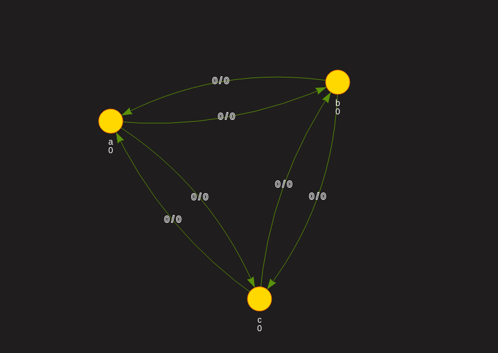

# grafana-directed-replication-graph-panel

  

  Grafana panel plugin to create directed graph based on queries data.
Based on:
+ [vis](http://visjs.org/) 
+ [angular-visjs](https://github.com/visjs/angular-visjs)
## Quick guide 
- To create a node you just need to add `#` with `node-id` into your queries alias.
Now you have the node with id which you typed after `#` in alias field. 
Node size and label depends on data returned by the query you've added the alias to.
    `#a`
- To create an edge you add to alias `node id without #=node id without #`. 
So if you want to connect node _#_**a** and node _#_**b** you add this alias to the query `a=b` and now there is an edge with id **a=b**. 
Based on the value returned by the query edge will change its opacity.
    `a=b`
- To add a title to the edge you can use `*` just add to the alias `*your-edge-id` and data from the query will appear as a label of this edge.
    `*a=b`
- To append something to existing edge's label you should add `+` after `*` and your query's value will be shown after old label and `/` sign
    `*+a=b`
- To subtract some query's value from edge's label value you can use minus `-`. After your edge's label alias add `-nuber_of_query` ( the number starting from 0) and it will subtract this value and show the new label.
    `*+a=b-2`